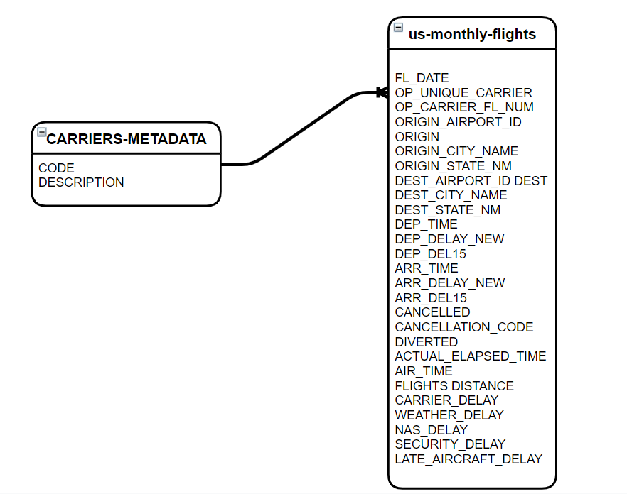

# On-time Performance of airlines in United States

- [Outline of project](#on-time-performance-of-airlines-in-united-states)
  - [1. Project description](#1-project-description)
  - [2. How data pipeline was built?](#2-how-pipeline-was-built?)
  - [3. Analytics and visualizations](#3-analytics-and-visualizations)
  - [4. Conclusion](#4-conclusions)

## 1. Project description

The purpose of this project is to build a data infrastructure that is needed to get insight into the on-time performance of airlines in the united states. This KPI is particularly interesting because it allows airlines to compare their on-time performance with other airlines. This affords them the opportunity to dig into their operations and processes for area of improvement. 

The US flights data was culled from [Bureau of Transportation Statistics (BTS)](https://www.transtats.bts.gov/Tables.asp?QO_VQ=EFD&QO_anzr=Nv4yv0r%FDb0-gvzr%FDcr4s14zn0pr%FDQn6n&QO_fu146_anzr=b0-gvzr). This contains monthly dataet from January to December 2020. The detailed data contains information about scheduled flight time, actual flight time, departure delay, cancellations, delay causes and so on. The schema of the data(`us-monthly-data` and `CARRIERS-METADATA`) pulled from the source are shown below.

## 2. How data pipeline was built?

### 2.1 Loading of data in S3

The `us-monthly-data` contains 12 files from January 2020 through December 2020 and `CARRIERS-METADATA` were loaded into the bucket URI `s3://us-flights/raw/`. Find below the preview of files in that location.

### 2.2 Preparing data with AWS Glue Databrew

In using AWS Glue Databrew, 3-prong step is used. Firstly, dataset is first created using `s3://us-flight/raw/249819445_T_ONTIME_REPORTING_<.*>.csv` to capture all 12 monthly files(`us-monthly-data`). Secondly, recipe is prepared by detailing the transformations(removing unwanted column, joining `us-monthly-data` and `CARRIERS-METADATA` using __OP_UNIQUE_CARRIER__ and __CODE__ respectively) to be performed on the data. Finally, job is created on as demand basis while outputing the file `s3://us-flight/curated/parquet/`. 

The cleaned data is stored in parquet form in order to improve efficiency of query processing using Athena. The data lineage(steps performed) of the job is as shown below.

### 2.3 Crawling using AWS Glue

__Crawling__ is essential in order to get the schema of the parquet-based files in `s3://us-flight/curated/parquet/`. Crawling is performed using AWS Glue. It is essential to provide the required policy and role needed to allow Glue to crawl S3 bucket. `S3Policy.txt` file in the directory structure and `AWSGlueServiceRole` were used to effectively grant AWS Glue the impressive capability of crawling S3 bucket for schema discovery.

## 3. Analytics and visualizations

In other to gain insight into the on-time performance of the clean data. Athena is setup to run queries on the US Flights data in S3. Nevetheless, athena is created successfully by creating a __new directory structure__ in the S3 bucket with the URI `s3://us-flight/curated/us-airlines-athena-query-results/`-- This directory is needed for storing Athena query results; followed by a __database__ where the schema of the data is stored and finally a workgroup that allow the QuickSight user(s) to visualize data in Athena database. 

The visual below shows the data catalog of the clean data and the data obtained after running all queries in `us-airline-analytic-queries.sql` file. The queries were used to gather information on the airlines such as number of flights, distance, cancellations and on-time performance. Finally, the day and month with the most flights were obtained.

Finally, Basic visualizations were performed using QuickSight as shown below. It was gathered that `Hawaii Airline` has the best on-time performance. However, It has the lowest number of flights.

## 4. CONCLUSION

In sum, further analysis can be performed on a variety of features to probe the data further. For example, a particular airline can decide to compare their operations with their competitors by analyzing data on the causes of delay. In addition, Network analysis can be performed in order to know the airline that dominates a certain flight route which can help other airlines' competitive strategy.

These use cases can be solved by using the data product generated in this project because appropriate information on the origin airport, destination airport, and delay causes were provided. The data product can withstand adhoc queries of and help whet the appetite of the exploratory adventure of the data analyst.

